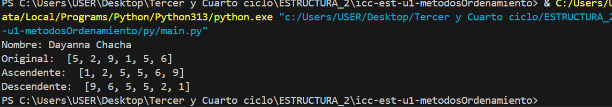
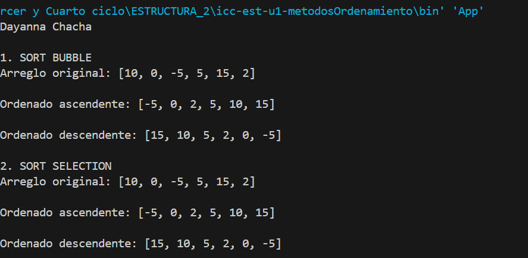
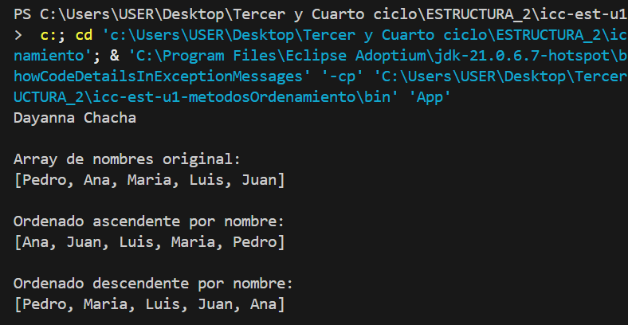
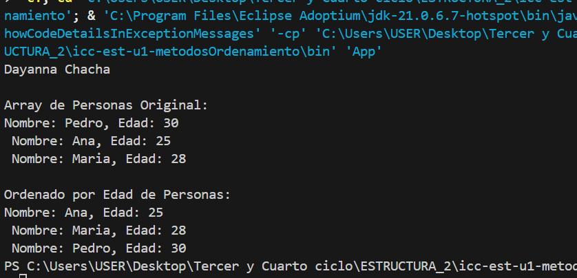

# Estructura de datos 

**Estudiante:** Janelly Dayanna Chacha Velez

## Metodos Ordenamiento

### Practica 1 - 21/OCT
Metodo Sort Bubble

### Practica 2 - 21/OCT
Metodo Sort Selection en Java y Python

Salida de Python

Salida de Java

### Practica 3 - 23/OCT
Arreglo de cadenas (nombres)

Arreglo de personas ordenado por nombre

Arreglo de personas ordenado por edad
